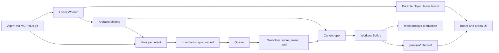

# Locus — plan for the Cloudflare Git competition

Status: building. Entrant confirmed a United States resident on October 2, 2026.
Product: **Locus**, a landing system for concurrent coding agents.
Repo: public, Apache-2.0, account `arjunkshah12345-hash`.
Deadline: submit October 13, 2026. Contest closes October 14, 2026, 11:59pm PT.

This file is the build spec. The README is the judge-facing quickstart.

## Eligibility

Confirmed:

- United States resident.

Still required before the form goes in:

- Age 18 or older on October 1, 2026. The rules void the entry otherwise.
- Not a Cloudflare employee, household member of one, or a government employee.
- Able to be in the room at Moscone West on October 21, 2026 if selected. The winner has to be physically present. Travel for up to two people is covered. Passports, visas, and meals are not.

One submission only. A second form voids the entry. Automated submission is forbidden.

## Contest

Sources:

- https://www.cloudflare.com/git-competition/
- https://blog.cloudflare.com/next-git-platform-on-cloudflare/
- https://www.cloudflare.com/documents/build-next-gen-git-platform-competition-terms.pdf
- https://developers.cloudflare.com/artifacts/

| Item | Fact |
| --- | --- |
| Opens | October 1, 2026, 9:00am ET |
| Closes | October 14, 2026, 11:59pm PT |
| Finalists announced | October 16, 2026 |
| Stage | October 21, 2026, Cloudflare Connect, Moscone West, San Francisco. 10 minutes. |
| Finalists | 3 teams, up to 2 travelers each |
| First place | $25,000 in Cloudflare credits, valid 12 months, plus the VIP speaker dinner |
| License of the project | MIT, Apache-2.0, or BSD-2/3, with a `LICENSE` file. We use Apache-2.0. |
| IP | We keep the project. The demo video and our names can be used promotionally. Submissions are not confidential. |
| Platform | Workers and Artifacts are mandatory. Workers Paid plan. Artifacts is open beta. |
| Package | 5–10 minute video, public source, run instructions |

### How they score

| Criterion | Weight | Tie-break |
| --- | --- | --- |
| Originality and quality of the prototype for agent-oriented collaboration | 50% | Highest score here wins a tie |
| Multi-agent concurrency, coordination, context preservation, review, and conflict handling | 25% | |
| Ease of use and product feel | 25% | |

The brief, in their words: hundreds or thousands of agents on one codebase. How does an agent know what the others are doing? What happens on a conflict? How do you review the pile? How do you keep **why**, not only the diff? How do you compare several changes and decide which one ships?

Artifacts is the foundation they already shipped: create, fork, repo-scoped tokens, Git, push events, Workers Builds previews. Locus is the layer above that. A GitHub clone with an agent button loses the 50% category. Fork-per-agent followed by `git merge` is their getting-started guide, so it is the baseline, not the entry.

## Product

Agents do not collaborate through branches. They **claim a locus**: a goal, a surface, a lease, a private Artifacts fork, and a written reason. The canon repo only receives the change that wins.

Three moments the demo has to show without a narrator rescuing it:

1. Eight agents edit one Worker at the same time. Disjoint claims land on their own.
2. Two or more agents touch the same file. Locus opens an arena: live previews, the same checks, both reasons, and a land-or-abandon decision.
3. A later agent asks why a file looks the way it does, reads the active leases, and claims a free surface.

Tagline: agents claim a locus, work in a fork, and the canon only lands what wins.

## Architecture



### What each piece owns

**Canon.** One Artifacts repo in a namespace, connected to Workers Builds. `main` is production. Branches named `preview/<intent-id>` exist only so Workers Builds can mint a preview URL. Agents do not work on those branches.

**Fork per intent.** `using repo = await env.ARTIFACTS.get(canon); const forked = await repo.fork(name, { defaultBranchOnly: true })`. The fork has its own remote, tokens, and history. A write token is minted for that agent and returned once. It is not stored on the lease board. Context lives in the fork at `.locus/intent.json` and `.locus/context/`.

**Lease board.** One Durable Object per project. Git is history. The board is who holds what right now. A claim is a hint. A later push event replaces the hint with the real diff. Heartbeat plus a 15 minute TTL drops a dead agent.

**Event path.** Subscribe to `cf.artifacts.repo.pushed`, `repo.forked`, and `repo.deleted`. A Queue consumer starts a Workflow per intent. That is their own sample, pointed at landing instead of a generic review comment.

**Preview bridge.** Isolation is a fork. Previews are branches on the connected canon repo. When an intent is ready or contended, copy the fork tip onto `preview/<id>`. If that bridge is awkward on day one of the spike, deploy a preview Worker from the fork tree and keep the same card UI.

**Why log.** Landing writes `.locus/landed/<id>.json` into canon: goal, agent, evidence, sibling intents that lost. The next brief is `AGENTS.md`, plus active leases, plus the latest landed capsules. `ask_why(path)` reads that log.

**Referee.** Contested intents go to a Workflow. A Sandbox runs the shared checks against both trees. A short Workers AI call must answer `land_a`, `land_b`, `synthesize`, or `human`, citing the checks. Synthesis opens a third intent whose parents are the two losers. The human sees the arena when policy says so. Until that Workflow exists, a person lands the winner from the board, and the losers are abandoned with a reason. That decision is already implemented.

### Artifacts limits we design around

Published October 1, 2026:

| Limit | Value |
| --- | --- |
| Repositories | Unlimited |
| Namespaces | Unlimited |
| Storage per repo | 1 GB |
| Blob size | 32 MB |
| Storage per account | 1 TB, raisable |
| Control plane | 2,000 requests / 10 seconds / namespace |
| Git | 2,000 requests / 10 seconds / repo |
| Names | 2–63 characters. Start with a letter or digit. Then letters, digits, `.`, `_`, `-`. |

Repo-per-intent is the scale story. The Durable Object only tracks active leases. Past the per-namespace rate, shard namespaces. The demo runs eight agents and says this out loud. It does not pretend to boot a hundred thousand model calls.

Repo-scoped tokens do not cross repositories. `read` for clone and review. `write` only for the agent that owns the fork.

Binding we will call (Wrangler 4.145 or newer, `npx wrangler types`):

- `env.ARTIFACTS.create(name, opts)` on first canon setup
- `using repo = await env.ARTIFACTS.get(name)`
- `repo.info()`, `repo.readFile({ ref, path })`, `repo.fork(name, { defaultBranchOnly: true })`
- `repo.createToken("write", ttlSeconds)` when the fork result has no token
- Queue subscription for `cf.artifacts.repo.pushed`

`readFile` returns a `Blob` or `null`. Handles are disposable. Release them before the request ends.

Billing: the blog says Artifacts billing starts October 15, 2026. The changelog says October 14, 2026. Either way it is at the deadline. Build on the Workers Paid plan. Keep the demo repo small.

## Data model

```ts
type Surface = { paths: string[]; symbols: string[] };

type Intent = {
  id: string;
  title: string;
  goal: string;
  agentId: string;
  surface: Surface;
  status: "active" | "ready" | "landed" | "abandoned";
  contended: boolean;
  conflicts: string[]; // other intent ids
  forkRepo: string | null;
  remote: string | null;
  previewUrl: string | null;
  createdAt: number;
  expiresAt: number;
  landedAt: number | null;
  abandonedReason: string | null;
};
```

V1 lease keys are exact: `path:<file>` and `symbol:<file#export>`. Sharing a path conflicts even when the symbols differ. That is the demo. Finer AST leases can come after the video if the arena already works.

A claim stores no Git token. The claim response may include a token once.

Landed intents are the why-log until canon commits exist. `why(path)` returns landed intents whose surface contains that path.

## Lease rules

Implemented in `src/lease.ts`. These are the rules the tests lock:

1. A claim starts `active` with a 15 minute lease.
2. Active and ready intents that share a path or a symbol are `contended`. Landed and abandoned intents hold nothing.
3. `land` succeeds only when the intent is not contended.
4. `decide(winner)` lands the winner and abandons every intent that overlaps it. The abandoned reason names the winner.
5. A heartbeat extends the lease. A missed heartbeat, observed on the next read, marks the intent abandoned.
6. Disjoint ready intents can land while a contended cluster is still open.

Day 1 already does this in the Durable Object and on the board. Later days replace the human `decide` click with the referee Workflow, and replace the claimed surface with the surface from the actual diff.

## Agent protocol

MCP tools. Agents still `git push` to the fork remote.

| Tool | Returns |
| --- | --- |
| `list_active` | Goals, surfaces, holders |
| `claim` | Remote, one-time write token, brief, contention |
| `heartbeat` | Extended expiry |
| `append_context` | Commits under `.locus/context/` in the fork |
| `mark_ready` | Moves the card to ready. Arena opens when surfaces intersect. |
| `ask_why` | Landed capsule that last changed the path |

The brief injected at claim time is `AGENTS.md` from canon, the active lease list, and the latest landed capsules. That is how a new agent avoids repeating work.

## HTTP API

Served by the Worker. State is one Durable Object named `locus`.

| Method | Path | Effect |
| --- | --- | --- |
| `GET` | `/api/intents` | Board snapshot |
| `POST` | `/api/intents` | Claim. Forks canon when `ARTIFACTS` and `CANON_REPO` are set. |
| `POST` | `/api/intents/:id/heartbeat` | Extend lease |
| `POST` | `/api/intents/:id/ready` | Mark ready and recompute contention |
| `POST` | `/api/intents/:id/land` | Land a free intent |
| `POST` | `/api/intents/:id/decide` | Land this intent, abandon its overlaps |
| `POST` | `/api/demo/seed` | Load the eight-agent story. Does not create Artifacts repos. |
| `GET` | `/api/why?path=` | Landed intents that touched the path |
| `GET` | `/` | Board UI |

## Board

One screen. This is the 25% product score.

- Canon summary on top: how many are active, contended, landed.
- A card per intent: agent, goal, surface, status.
- Contended cards name the other intents and offer **Land this one**.
- Free ready cards offer **Land**.
- **Seed demo** loads the scripted swarm so a judge sees the story with no model keys.
- Empty state tells you to seed.

Visuals: near-black field, warm paper cards, Cloudflare orange only on contention and the primary button. No second product metaphor, no dashboard of charts.

## Sample canon

`fixtures/sample` is the Worker the swarm edits. Four real files plus a new-file claim:

| Agent | Intent | Surface | Expected |
| --- | --- | --- | --- |
| agent-rate | Rate limit `/flags` | `src/index.ts` | Lands |
| agent-default | Change the flag default | `src/flags.ts` | Arena |
| agent-audit | Audit flag writes | `src/flags.ts` | Arena |
| agent-default-b | Alternate flag default | `src/flags.ts` | Arena, best of n |
| agent-docs | Document the flags | `README.md` | Lands |
| agent-auth | Tighten token checks | `src/auth.ts` | Lands |
| agent-obs | Add a log helper | `src/log.ts` | Lands |
| agent-reader | Read why, then claim health | `src/health.ts` | Stays active, no overlap |

The arena cluster is the three flag intents. The reader is the context beat: `why(src/index.ts)` names `rate-limit` after it lands.

## Demo video, 7 minutes

Record October 11. Submit October 13.

| Time | Picture |
| --- | --- |
| 0:00 | Canon flag service is live. "Eight agents are about to edit it together." |
| 0:40 | Seed the board. Cards show goals, not branch names. |
| 1:30 | Three cards share `src/flags.ts`. The others stay clear. |
| 2:30 | Disjoint intents land. Production updates. Say that previews come from Workers Builds. |
| 3:30 | Arena. Both previews, same check, both why capsules. Land one. The others stay in history as abandoned, with the winner's id on them. |
| 5:00 | A new agent calls `ask_why` and claims a free surface. |
| 6:00 | Architecture for ten seconds: unlimited Artifacts repos, lease board is O(active intents), push events enter through a Queue. Name the rate limits. |
| 6:40 | Repo URL, `npm run demo`, Apache-2.0. |

Stage talk on October 21 is this demo live, plus the scale answer: forks are already isolated; the Durable Object tracks active leases; namespaces shard past 2,000 control-plane requests per 10 seconds.

## Repo layout

```
PLAN.md                 this spec
README.md               judge quickstart
LICENSE                 Apache-2.0
src/lease.ts            lease rules, no I/O
src/demo-script.ts      eight-agent story
src/artifacts.ts        fork + one-time token
src/board.ts            Durable Object
src/page.ts             board UI
src/index.ts            Worker routes
fixtures/sample/        canon the agents edit
test/lease.test.ts
demo/run.ts             npm run demo
wrangler.jsonc
```

Later, same repo, only when the day-1 path is solid:

```
src/workflow.ts         referee and land
src/queue.ts            Artifacts push consumer
mcp/                    claim, heartbeat, ask_why
```

Host on `arjunkshah12345-hash/locus`. This is not a SuperCompress product repository.

## Build order

Today is October 2. Leave October 14 empty.

| When | Ship | Gate |
| --- | --- | --- |
| Oct 2–3 | Lease engine, board, demo seed, fork helper. **In progress.** | `npm test` and `npm run demo` |
| Oct 2–3 spike | Paid Workers account. Canon repo, fork, token, `readFile`, push event into a Queue, one preview URL. | Stop and redesign the preview bridge if Workers Builds cannot preview a pushed branch |
| Oct 4–5 | Claim API creates a real fork. One scripted agent edits a file and pushes. | `git push` to the fork shows up as a push event |
| Oct 6–7 | Board wired to live forks and preview URLs | A card shows a real preview |
| Oct 8–9 | Arena checks in a Sandbox, referee via Workers AI, land writes `.locus/landed/<id>.json` to canon | Two conflicting forks, one lands, why file is in canon |
| Oct 10 | Ninth agent reads the brief and avoids the lease. Freeze the script. | Rehearse the 7 minute cut once |
| Oct 11 | Record. Captions on. | Video is 5–10 minutes |
| Oct 12 | README a stranger finishes in 10 minutes. Public repo. | `npm run demo` from a clean clone |
| Oct 13 | Submit the form. Save the confirmation. | Do not submit again |

## Submission form

https://www.cloudflare.com/git-competition/submit/

Known requirements: team, 5–10 minute demo, source link, run instructions, acceptance of the official rules. The form is client-rendered; confirm every field the morning of October 13. Team name: **Locus**.

## Cut list

Leave these out. They sink the video.

- Another Git server, orgs, billing, or a general code host
- Multi-language AST. TypeScript path leases are enough for the sample.
- A live run of thousands of model agents
- An IDE, issue tracker, or pull-request inbox
- Storing Git tokens in the Durable Object

## Scoring map

| Piece | Points it feeds |
| --- | --- |
| Intent, lease, fork, why-capsule in canon | Originality, 50% |
| Eight concurrent agents and a live lease map | Coordination, 25% |
| Arena, checks, recorded land-or-abandon | Review and conflicts, 25% |
| Brief and `ask_why` | Context, 25% |
| One board, preview on the card, `npm run demo` | Product, 25% |
| Workers, Artifacts forks, Queues, Workflows, Workers Builds | Mandatory platform |

## Day 1, October 2

Shipped in this repo, and checked on October 2:

- Lease rules and tests, including decide, expiry, and the demo story. `npm test` passes.
- Durable Object board and the HTTP API above. Local `wrangler dev`: seed shows 1 active, 3 contended, 4 landed. Landing `flag-default` abandons the other two flag intents.
- Board UI with seed and land. The same flow works in a browser against the local worker.
- Artifacts fork helper matching the current binding (`get`, `info`, `readFile`, `fork`, `createToken`)
- Sample canon under `fixtures/sample`
- `npm run demo` prints the eight-agent story with no Cloudflare credentials

Not shipped yet, on purpose:

- A live Artifacts namespace. Claim stores `forkRepo: null` until `ARTIFACTS` and `CANON_REPO` are configured.
- Push-event Queue, referee Workflow, Workers Builds preview bridge, MCP server.

Next action is the spike: create the canon repo with the binding, fork once, push once, and catch `cf.artifacts.repo.pushed`.
